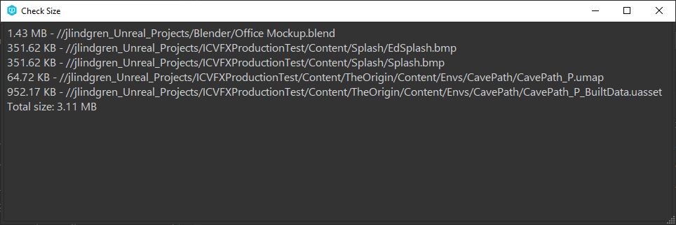

# p4_changelist_size
Small script to check the size of a Perforce changelist and give a rough approximation of how long it will take to submit. 

> Note:
   Estimates of how long it will take to submit are *very* approximate and should not be relied on for anything critical. Varying internet traffic, server load, number of files in a changelist, and number of parallel threads can all affect the actual time it takes to submit.

This script can be setup to run as a [right-click menu item in P4V](#P4V-Setup-and-Usage) or as a [command line tool](#Command-Line-Usage).

## Pre-requisites
You must have the P4 command line client installed and have a Perforce server running.
(If you installed P4V then you already have the command line client.)

If you are on Windows then you can use the precompiled EXE file in `bin/`

If you are on another operating system or want to be able to modify the script then you will need to have Python 3 installed, as well as a few modules:
   - `p4python`: The Perforce Python API.
   - `speedtest-cli`: A module for testing internet speed.
   - `appdirs`: A module for finding cross platform application directories.

You can install these modules using the following command from the p4_changelist_size directory:

      pip install -r requirements.txt

## P4V Setup and Usage
1. In p4v, go to `Tools` -> `Manage Tools` -> `Custom Tools`
   
2. In the Custom Tools Window, select `New` -> `Tool...`
   
3. Fill out the highlighted fields EXE or Python usage:
   
   **If using the EXE file on Windows**:
   

   **If using the Python file** (Note that the `Application` field is the path to your Python installation and the `Arguments` field is the path to the script plus the `%c` variable for the changelist number):
   
4. Click `OK` to save the tool. Now you can use the tool in p4v by right clicking on a changelist and selecting the tool by name.
   
5. This will pop up a terminal window that will list all files in the selected changelist and their size. At the bottom it will list the total file count, total size of all the files in the changelist, and an estimate of upload time.
   

## Command Line Usage
`p4_changelist_size` works like the p4 command line in that it will look in the current working directory for a config file path that matches your P4CONFIG setting or will use your default settings if none is found. (Be sure to check this is you are getting results for the wrong server or depot)

### Using the EXE file
On windows you can simply run the `p4_changelist_size.exe` file from the `bin\` directory and specify the changelist number (or `default` for the default changelist).

### Using the Python file
Run the `p4_changelist_size.py` using Python 3 and specify the changelist number (or `default` for the default changelist).

You may need to specify a full path to the script if you are trying to run from a specific workspace directory.

For example:

      python3 ~/downloads/p4_changelist_size/p4_changelist_size.py default
