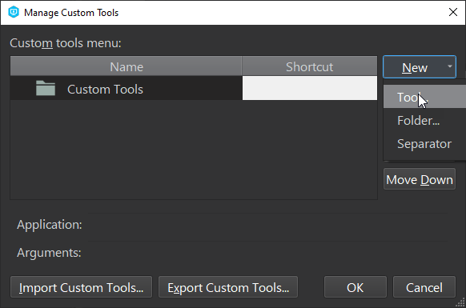

# p4_changelist_size
Small script to check the size of a Perforce changelist to determine how long it will take to upload.

## Pre-requisites
If you are on Windows then you can setup the script by using the .exe file in `bin/`.

If you are on another operating system or want to be able to modify the script then you will need to have Python 3 installed, as well as the P4PYTHON api https://www.perforce.com/downloads/helix-core-api-python

## p4v Setup and Usage

1. In p4v, go to `Tools` -> `Manage Tools` -> `Custom Tools`
   
2. In the Custom Tools Window, select `New` -> `Tool...`
   
3. Fill out the highlighted fields EXE or Python usage:
   
   **If using the EXE file on Windows**:
   

   **If using the Python file** (Note that the `Application` field is the path to your Python installation and the `Arguments` field is the path to the script plus the `%c` variable for the changelist number):
   
4. Click `OK` to save the tool. Now you can use the tool in p4v by right clicking on a numbered changelist and selecting the tool by name. (Note: The tool cannot currently be used on the default changelist. Chagnes must be added to a numbered changelist before checking their size)  
   
5. This will pop up a terminal window that will list all files in the selected changelist and their size. At the bottom it will list the total size of all the files in the changelist.
   